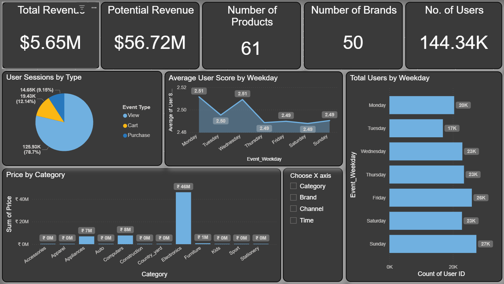

# **Power BI Desktop**
This repository has a Power BI Desktop Case Study on E-Commerce Sales and Promotion Data.

The dashboard is developed by Devanshu Bharti.

---

---

## **Goal of the case study:**

Work with data sets using the Power BI Tool. 

You should be able to analyze data and answer the key business questions with the help of dashboards and report and derive insights

Also, you should document & communicate the insights and findings from the data.

---

## **Business Case:**
As analyst and you are working for leading e-commerce client. The client asked you to create analytical dash boards below themes.

• Overview about various KPI’s

• Pricing & Promotion

• Search & Recommendations

etc.

While building dashboards, you are expected to clean the data if required. Once you clean the data, you need to answer below questions as part of the documentation

a. What variables can be derived out of the data which can be helpful?

b. Who can use this dashboard?

c. What value would be generated by using this dashboard ?

d. What additional data can be helpful to add more insights & value to the team?

---

## **About Data:**
The below data sets were provided by our client (one of leading eCommerce company). This data is about customer behavior which contains data of
multiple user events. The duration of the data for two months.
1. Sales_Data_Ecommerce : The entire customer behavior data
2. Promotion: This is promotion data set of special promotions for that day. One product will be promoted in first page of app/website. In addition to that
there are many promotions running however the data is limited special promotion.
